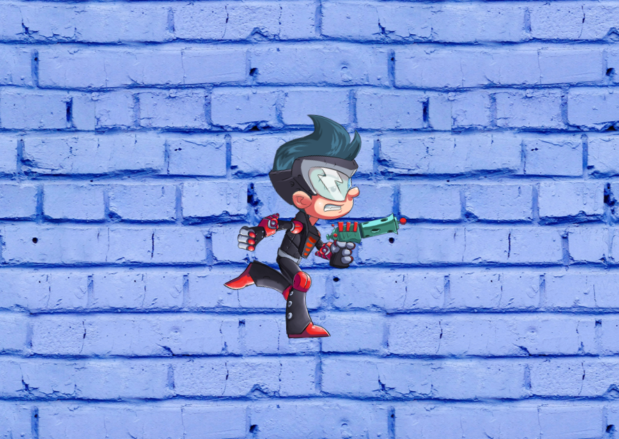

# react-spine-pixi-starter

Example of the Spine Pixi runtime invoked and destroyed within the React lifecycle

[View demo](https://loksland.github.io/react-spine-pixi-starter/?config)

### Features

- Pixi 8.x
- Supports React strict mode
- Hot module reloading
- Typesafe
- Retina display support

### Credits and licensing

The running spineboy demo is provided as part of the [Spine runtime library](https://github.com/EsotericSoftware/spine-runtimes).

Please be aware the Spine Runtimes have licensing requirements.

For the official legal terms governing the Spine Runtimes, please read the [Spine Runtimes License Agreement](http://esotericsoftware.com/spine-runtimes-license) and Section 2 of the [Spine Editor License Agreement](http://esotericsoftware.com/spine-editor-license#s2).
